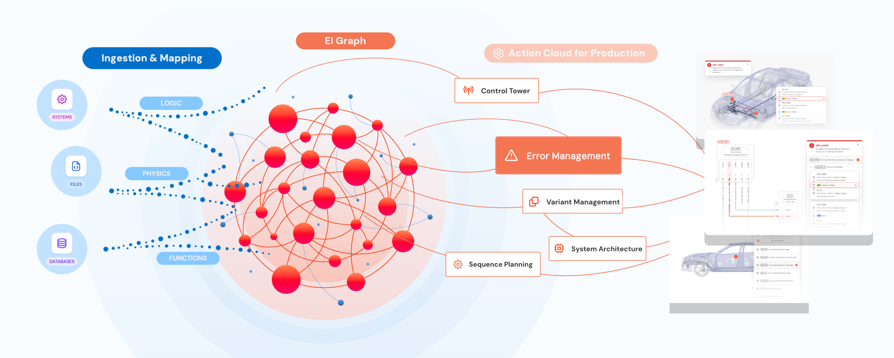

The central feature of SPREAD is the Engineering Intelligence Graph (EI Graph), which is also referred to as the Engineering Intelligence Network (EIN). The EI Graph is a GrapQL-based database where structured product data is stored. Graph databases are different from relational databases, such as MySQL, in that they use graph structures with nodes, edges, and properties to represent and store data. Relationships between nodes are key and in this way SPREAD is able to contextualize the relationships between the interactions of complex products.

## Product data cycle

<figure markdown="span" class="noborder">
	{ .skip-lightbox }
	<figcaption>The SPREAD product data cycle</figcaption>
</figure>

The cycle consists of three parts:

* **Ingesting data**: As this stage we import product data into the EI Graph. Product data such as: CAD files, Bill of Material, electronics, wiring, diagnostic, signals data, DTCs, component IDs, configuration codes, 3D models, communication matrix and more.
* **Contextualizing data**: The data is integrated into the structured SPREAD information model, which enables data insights. For example, this allows you to match PR-Nr and BoM to provide VIN-specific troubleshooting recommendations.
* **Data insights**: From a base of structured knowledge we can create a multitude of applications for data visualization, predictive analytics, and automated insights. These applications enable you to interpret complex product data and make informed decisions.

### Example

An automotive company looking to build a new model may have many teams involved in the development process: from Wiring Harness Engineers to Industrial Engineers to Production Managers to Process Planners to Rework Engineers. Each of these teams works in their data silo, creating data using custom methods and outputs.

This creates problems when the vehicle they're working on needs to be put together. For example, Rework Engineers may have a difficult time understanding and, more importantly, finding the data produced by the Wiring Harness Engineers.

With the EI Graph all of the information from all parts of the process are maintained in a structured way so that every team and engineer in the development process is working on same data source. Each team can then create applications to present the data in a way that's most useful for their area of work.

<ul>
<li>
<?quiz?>
question: Are you ready?
answer-correct: Yes!
answer: No!
answer: Maybe!
content:

Provide some additional content

<?/quiz?>
</li>

<li>

</li>
</ul>

