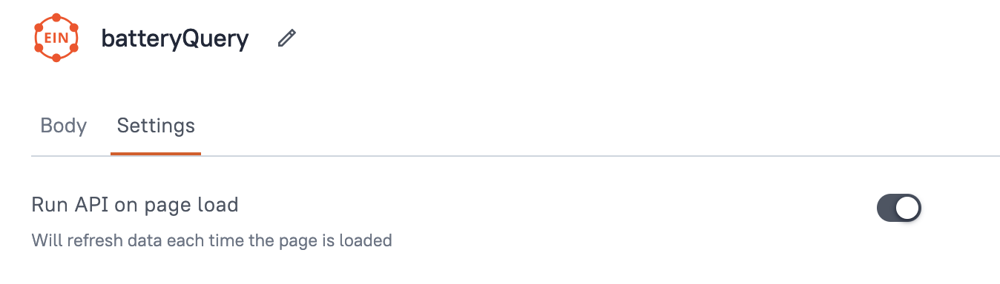

Now that we know how to fetch data from the Engineering Intelligence Graph we can create an application to display it. We're going to create an application that displays the dimensions of a battery within a table.

{{ snippets.demoInstanceDetails }}

## Creating the UI

Drag and drop a table widget onto the Studio canvas from the **UI** tab on the left-hand side. The highlighted options on the right-hand side is where we will add data from the query that we will bind to the table.

<figure markdown="span">
     
     <figcaption>Creating the display app UI</figcaption>
</figure>

## Creating the query

To create the query we will use from within Studio go to the **Queries** tab and select **New Query/API**.Select **EIN API** in the **Quick actions** section. Here you can see all the same objects that are in the Schema Definition Language (SDL) reference from the [previous lesson](querying-spread.md).

<figure markdown="span">
     
     <figcaption>Creating a query in the Studio interface</figcaption>
</figure>

Select the `battery` object in the **Explorer** window and select the `height`, `length`, and `width` fields. Add `{"id": xxxxxxxxx}` as the query variable (the ID is required for the query to work). Thenn select the **Run** button to confirm that the query works as expected.

<figure markdown="span">
     
     <figcaption>Creating a query in the Studio interface</figcaption>
</figure>

Swith to the **Settings** tab and set **Run API on page load**.

<figure markdown="span">
     
     <figcaption>Run API on page load</figcaption>
</figure>

## Binding the query

Switch back to the **UI** tab on the top-left and select the table widget that you dropped on to the canvas earlier. Select the **Table data** dropdown menu on the right-hand side and select the query you created.

<figure markdown="span">
     
     <figcaption>Binding the query to the table</figcaption>
</figure>

The fields returned by the query are default mapped as columns and you can edit them in the section below **Table data**.

## 

## Publishing and sharing the application

When the application is complete, select the **Publish** button in the top-right corner to make it available from the SPREAD Platform launcher page. To share the application with other users select the **Share** button (next to the **Publish** button) and add users who can either have **Developer** rights to edit the application or **Viewer** rights to just view it.

<figure markdown="span">
     
     <figcaption>Sharing your application</figcaption>
</figure>
