Now that we know how to fetch data from the Engineering Intelligence Graph we can create an application to display it. We're going to create an application that displays:

- The name of the feature variant. For example: `Airbags` in a vehicle.
- What components make up the feature variant. For example: airbags might consist of a component that senses when a crash has happened and a component that deploys the airbag.
- The software modules the components use to complete tasks. For example: the crash detection component might use software that determines when an impact has happened.

As software-defined products become more prevalent, the implementation end of a feature oftentimes involves a software module.

```mermaid
flowchart LR;
    	A["Feature Variant: 💨 Airbag"]-- contains --->C(["Component: 💥 Crash Detector"]);
     A["Feature Variant: 💨 Airbag"]-- contains --->B(["Component: 🎈 Airbag Deploy"]);
	C(["Component: 💥 Crash Detector"])-- implemented by --->D(("Software: 🤖 crash_sensing_software"));
     B(["Component: 🎈 Airbag Deploy"])-- implemented by --->E(("Software: 🤖 airbag_deployer_software"));
```



We will display these details in a table.

{{ snippets.demoInstanceDetails }}

To open Studio, select the **Studio** tile in the SPREAD Platform Launcher and [create a new application](module-1/creating-a-studio-application.html#organizing-your-workspace).

## Creating the UI

Drag and drop a table widget onto the Studio canvas from the **UI** tab on the left-hand side. The highlighted options on the right-hand side is where we will add data from the query that we will bind to the table.

<figure markdown="span">
     
     <figcaption>Creating the display app UI</figcaption>
</figure>

## Creating the query

To create the query we will use from within Studio go to the **Queries** tab and select **New Query/API**. Select **EIN API** in the **Quick actions** section. Here you can see all the same objects that are in the Schema Definition Language (SDL) reference from the [previous lesson](querying-spread.md). The Apollo Explorer is where we go to find queries (or mutations), but in order to apply them in a Studio application we need to do it in the **Queries** tab.

<figure markdown="span">
     
     <figcaption>Creating a query in the Studio interface</figcaption>
</figure>

Just as we did in the [previous lesson](querying-spread.html), we will enter a query in the **Query** window to fetch the data we need.

!!! abstract "Task 1: Find the right query"

     Given what we know [about finding queries](querying-spread.html#finding-the-query), go to [Apollo Explorer]({{ snippets.demoInstanceEinURL }}ein) to  investigate what query will return all the data that we are looking. As a reminder:
          
     - We have set up a dataset with the ID: `"EsfDatasets/de892a79-efab-4176-a282-e2c117cd1e23"`. Use this as the `datasetId` in the query.
     - We are looking for data in `featureVariants`:
          - We are looking for the names of all the `featureVariants`. Remember that we need to supply the language that the names are returned in.
          - We are looking for the names and IDs of the components that make up the feature variant. A quick hint: the name of the object that contains this data is `realizedInComponentVariant`.
          - We are looking for the software modules that these components use.
     
     Before revealing the answer, take a moment to try find the query on your own. Once you are done, check your answer against the snippet below.
     <br>
     <br>
     [See the solution](https://app.spread.ai/ein?explorerURLState=N4IgJg9gxgrgtgUwHYBcQC4TADpIAQEEBmCAhijAE4IBqplAlqagM4AUY5pLCKAkmHR5sIAKIsiAES48ULAPRgEADgCcAJlIB2VQFoERUgCNdAFgCMWgGy7S65ev3qo5y1DDmE6gMwiAlHjAwviEoQQMYMFhYUikiIG40UkEyFHJeAC%2BienUpAA2DABeCGB8SADCEHAADhBIyCh0jMwogWnpoRHtHQSx8TghPUmp2UOZo0MwPCwAyhBEKADu9AgAshBgMHkILG0TY4Rd%2Bwd4fQgJgyfDSMcHWZc99x1PofcZIAA0IABu9ExG2xYGBAIAyQA){ .md-button .md-button--primary }

<figure markdown="span">
     
     <figcaption>Creating a query in the Studio interface</figcaption>
</figure>

The results will appear in the bottom window under the heading **Response** > **JSON**. Switch to the **Settings** tab and enable **Run API on page load**, **Encode query params**, and **Smart JSON substitution**.

<figure markdown="span">
     { .img-medium }
     <figcaption>Run API on page load</figcaption>
</figure>

!!! abstract "Task 2: Name the query"

     The query needs a unique name so that it can be called from the UI. Name the query `featureVariants` so that we can use it in the next steps.

## Binding the query

Switch back to the **UI** tab on the top-left and select the table widget that you dropped on to the canvas earlier. Select  **Table data** and enter the following: `{{ "{{ featureVariants.data.data.featureVariants }}" }}`.

Let's look at what this means:

- `featureVariants.data` is the full object returned by the query named `featureVariants`. This is the same output we saw in the previous step, which begins: `{"data": {"featureVariants": [ ...all the listed featureVariants and their components... ]}}`
- To extract the list of feature variants we need to add `data.featureVariants` to complete the binding.

<figure markdown="span">
     { .img-medium }
     <figcaption>Binding the query to the table</figcaption>
</figure>

The fields returned by the query are mapped as columns and you can edit them in the section below **Table data**. For example, let's hide the **id** column from the table by selecting the **👁️** icon in the **Table** section.

<figure markdown="span">
     { .img-medium }
     <figcaption>Editing columns in a table</figcaption>
</figure>

### Editing the columns

<figure markdown="span">
     { .img-medium }
     <figcaption>The unedited name column</figcaption>
</figure>

You may have noticed that the name column entries have values like `{"en": "LIDAR"}` and not simply `LIDAR` as we would expect. The name column has taken the `name` object and used it for the field values, without extracting the `en` (or `de`) key of the object. If you recall earlier, the query returns:

```json "Segment of the query response" hl_lines="4 5 6"
...
{
        "id": "FeatureVariants/14ac1f3c-4517-450b-b2d6-86ad314e2420",
        "name": {
          "en": "LIDAR"
        },
        "realizedInComponentVariant": []
}
...
```

To get just the name we need to edit the name column by selecting the **⛭** icon next to it.

<figure markdown="span">
     { .img-medium }
     <figcaption>The name column settings</figcaption>
</figure>

Then setting the **Computed value** field to: `{{ "{{currentRow["name"].en}}" }}`. This extracts only the value of the `en` key to give us a clean name.

## Syncing data across widgets

Data can also be synced between widgets. We have hidden the **description** column but we can display it in another connected widget. Drag-and-drop the [container](../) widget on to the Studio canvas. Then drag and drop a [text]() widget on top of the container.

<figure markdown="span">
     { .img-medium }
     <figcaption>The container and text widgets below the table</figcaption>
</figure>

Select the text widget and in the **Text** input field in the settings on the left-hand side enter: `{{ '{{ Table1.selectedRow.name }}' }}`. This sets the value of the text field to the selected row in `Table1` and `name` column value of that row.
{ .annotate }

<figure markdown="span">
     { .img-medium }
     <figcaption>Set the value of the text field</figcaption>
</figure>

Similarly, you can set the value of fields in other widgets to sync with each other.

!!! error "'Table name' is not defined"

     If you get the error "'Table name' is not defined", check that that table you are syncing from has the same name as the one used in when binding the table to the text box. 

     { .img-medium }

## Publishing and sharing the application

When the application is complete, select the **Publish** button in the top-right corner to make it available from the SPREAD Platform launcher page. To share the application with other users select the **Share** button (next to the **Publish** button) and add users who can either have **Developer** rights to edit the application or **Viewer** rights to just view it.

<figure markdown="span">
     { .img-medium }
     <figcaption>Sharing your application</figcaption>
</figure>

<br>
[Download the solution (7kb) :material-download: ](src/module-2.zip){ .md-button .md-button--primary }
<figcaption class='download'>Unzip the file, open the [Studio Workspace](module-1/creating-a-studio-application.html#organizing-your-workspace), select <strong>Create New</strong> > <strong>Import</strong>, and import the unzipped file.</figcaption>
<br>

<blockquote class="next-lesson">In the <a href="module-3/studio-data-visualizations.html">next module</a> we will be looking at how to visualize data in Studio.</blockquote>
