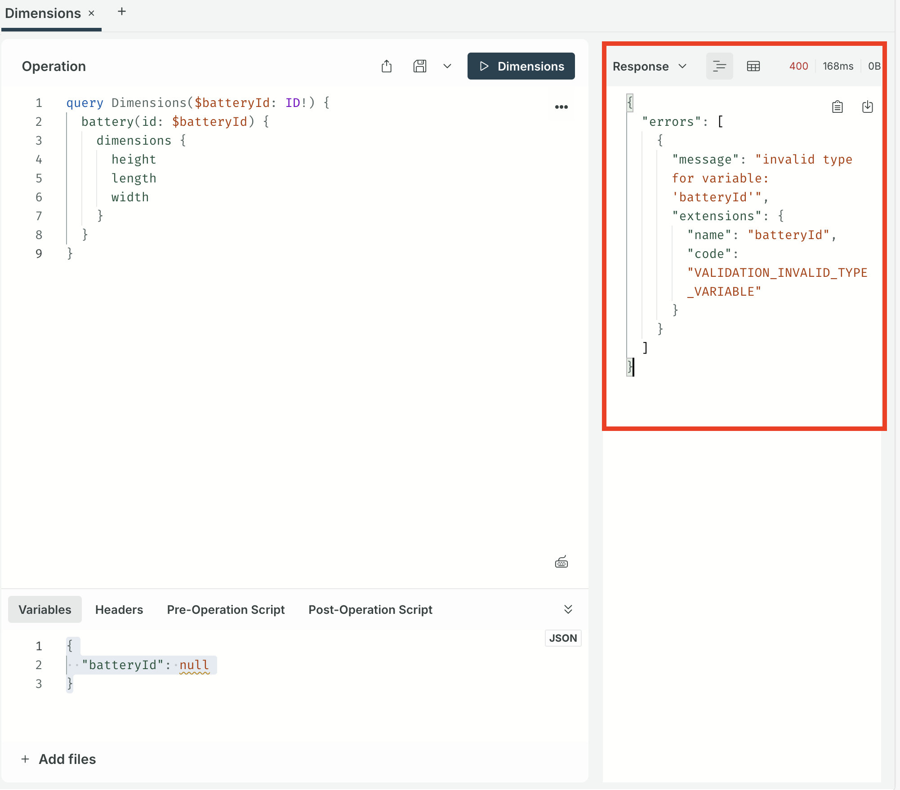

To get data from the Engineering Intelligence Graph we need to query the GraphQL database. GraphQL is a graph-based database that allows us to fetch only the data we need, unlike with REST APIs. In this lesson we will learn how to make a query from within SPREAD Studio and use the results in a [table](#) widget.

## GraphQL queries

To fetch data from a GraphQL database we use _queries_ in the similar way to a `GET` request in a REST API. The key difference being that the response can be defined, so that we get only the data need. A REST API request might return a JSON object that needs to be parsed afterwards to get the required data.

A GraphQL query contains the following:

<div class='grid' markdown>

!!! example "GraphQL query structure"

     ```json 
     query Battery($batteryId: ID!, $changesetId: ID) { // (1)
          battery(id: $batteryId, changesetId: $changesetId) { // (2)  
               createdAt // (3) This query will return the value of the field `createdAt`.
          }
     }
     ```
     1. The exclamation point in `ID!` tells us that this field is required for this query. The changeSetID is optional.
     2. The $ symbol is used to insert variables, such as the `batteryId` in this case.
     3. This query will return the value of the field `createdAt`.

!!! example "GraphQL query variables"

     ``` graphql
     {
          "batteryId": xxxxxxxxxx,
          "changesetId": xxxxxxxxxxxx
     }
     ```
</div>

## Finding the query

Knowing how to make query leads on to knowing where to find the query that gives you the information that you want. GraphQL provides a self-documenting function that produces the Schema Definition Language (SDL) reference, which is similar to REST API references. To view the SDL reference select the **EIN** tile from the SPREAD Launcher.

{{ snippets.demoInstanceDetails }}

!!! failure "Schema introspection failure"

     If you see a "Schema introspection failure" error when opening the EIN tile, go to the **Connection Settings** in the top-left and select **Include cookies** to resolve it.

     

<figure markdown="span">
     
     <figcaption>The EIN tile in the SPREAD Platform launcher</figcaption>
</figure>

Then select the **Schema** icon on the left-hand side to open the SDL reference.

<figure markdown="span">
     
     <figcaption>The button to access the SDL reference</figcaption>
</figure>

For example, to search for an endpoint that returns the dimensions of a battery, we would first bring up the search interface by pressing the **⌘ / CTRL** and **K** keys at the same time or by clicking the button at the bottom of the reference sidebar. Then enter the search term: in this case `battery`.

<figure markdown="span">
     
     <figcaption>The search button in the SDL reference is highlighted in the red box</figcaption>
</figure>

The results list returns an object named `Battery` as the first result, with the description:

     _Represents a high voltage battery, contains generic information about the battery model._

Selecting the object gives a deeper overview of the fields of the object, which include the field `dimensions`.

<figure markdown="span">
     
     <figcaption>Documentation about the `battery` endpoint</figcaption>
</figure>

## Exploring the endpoint field

To further explore the `dimensions` field select the play icon on the right to open the GraphQL Explorer.

<figure markdown="span">
     
     <figcaption>Explore the `dimensions` field</figcaption>
</figure>

The `dimensions` contains further fields within it: `height`, `length`, and `width`. Each returning float numbers. To run a test call on the endpoint add each of the fields to the query by selecting the **+** icon next to each of them and selecting the **▶️ Dimensions** button at the top of the **Operation** window.

<figure markdown="span">
     
     <figcaption>Running the API call on `dimensions`</figcaption>
</figure>

The API call returns an HTTP 400 error in the response window on the right-hand:

<figure markdown="span">
     
     <figcaption>An HTTP 400 error</figcaption>
</figure>

This is because we've not provided a `batteryId` value for the call. This value is a required field, as shown by the `!` in the **OPeration** window. Enter the following JSON into the **Variable** window at the bottom:

```json
{
  "batteryId": xxxxxxxx
}
```

Running the call again should return a successful response and the data we want. Note that changing the response is defined by what we ask for in the **Operations** window. If we added the `createdAt` field to the query the reponse would have an additional field with that data.

```json title="Adding the createdAt field to the query"
query Dimensions($batteryId: ID!) {
  battery(id: $batteryId) {
    dimensions {
      height
      length
      width
    }
    createdAt 
  }
}
```
