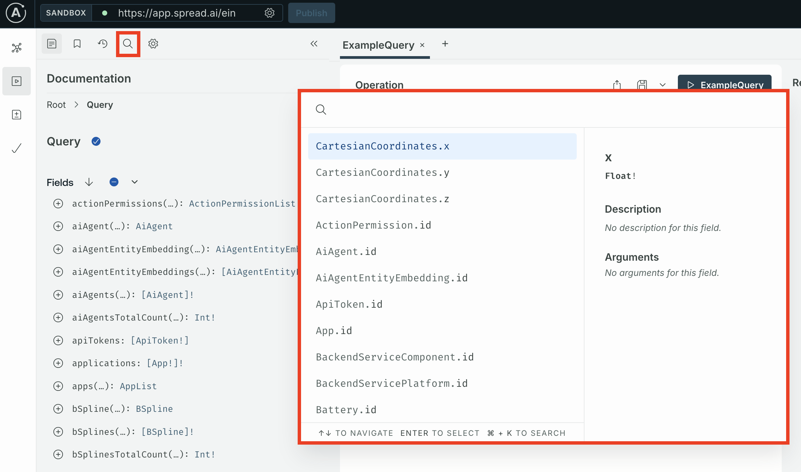
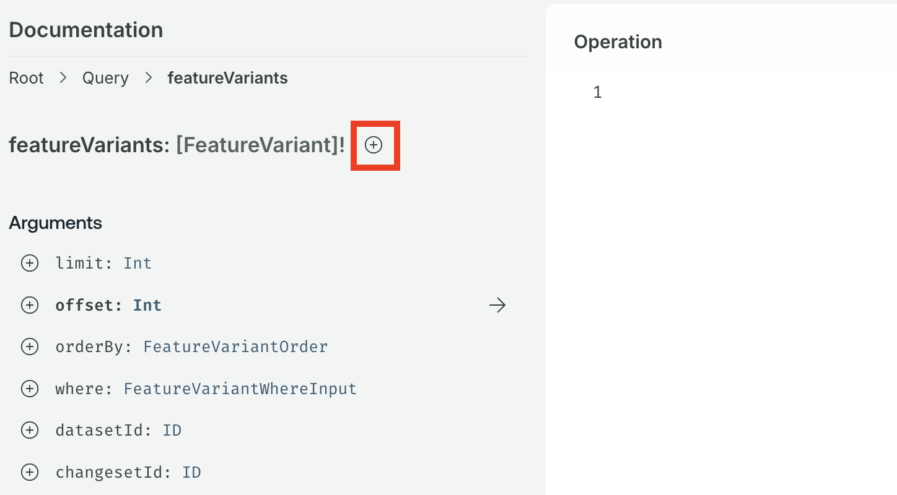
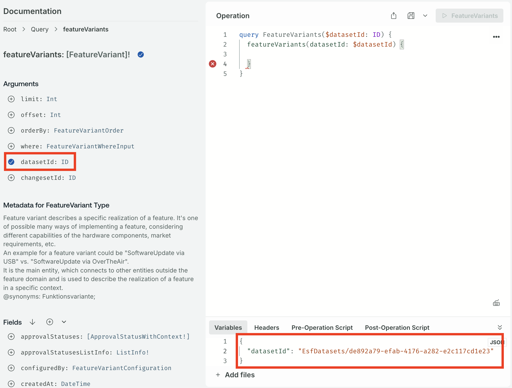
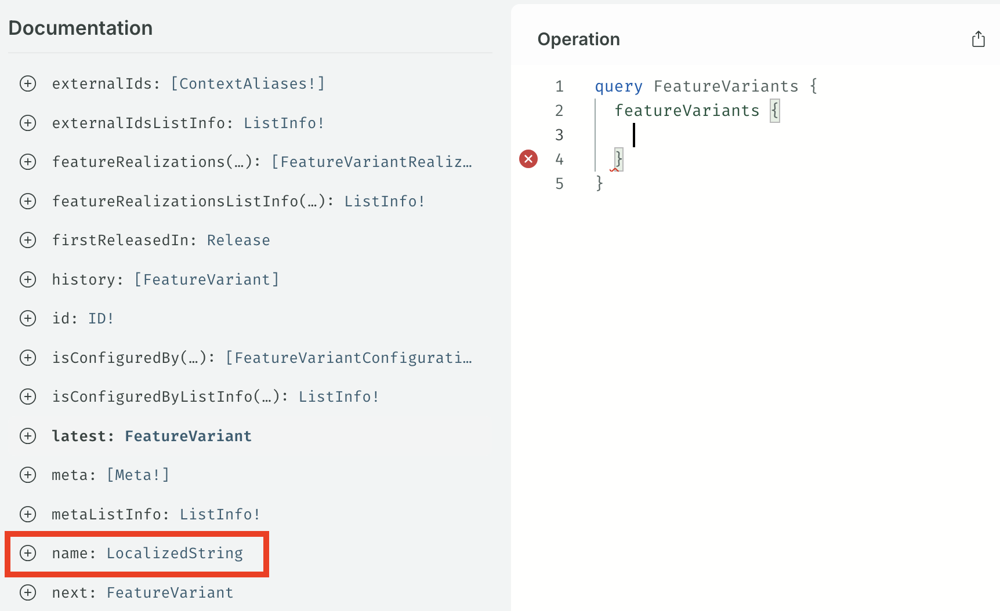
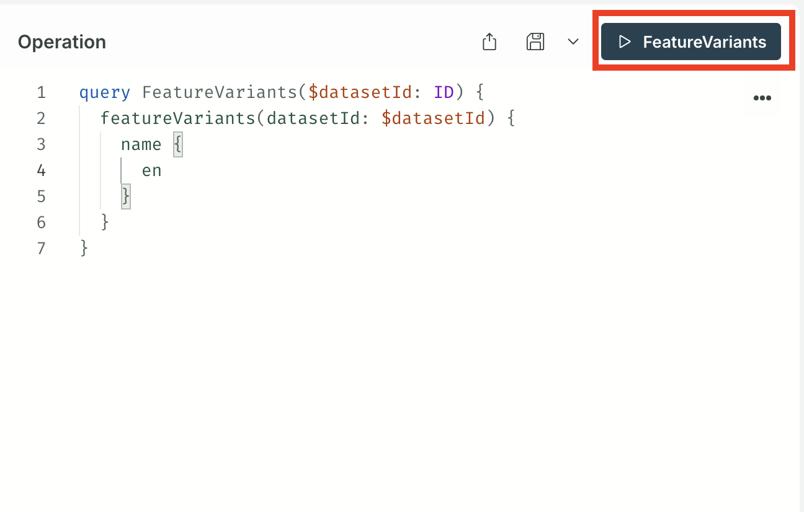

To get data from the Engineering Intelligence Graph (EI Graph) we need to query the GraphQL database. GraphQL is a a query language that allows us to fetch only the data we need, unlike with Representational State Transfer (REST) APIs. In this lesson we will learn how to make a query from within SPREAD Studio and use the results in a Table widget. The advantages of GraphQL over using REST APIs include:

- You can define custom queries that request exactly the data you need. This eliminates the need for multiple endpoints and reduces unnecessary data transfer.
- GraphQL organizes your data into clear fields, making it easier to manage and display on the frontend.
- GraphQL offers better error handling compared to many REST APIs

## GraphQL queries

To fetch data from a GraphQL database we use _queries_ in the similar way to a `GET` request in a REST API. The key difference being that the response can be defined, so that we get only the data we need. A REST API request might return a JSON object that needs to be parsed afterwards to get the required data. To learn how to create queries we will use Apollo Explorer, which is an environment to test GraphQL queries and mutations. To open Apollo Explorer, use the details below:

{{ snippets.demoInstanceDetails }}

### Using Apollo Explorer

#### Finding the query

First we need to know where to find the query that gives you the information that you want. GraphQL provides a self-documenting function that produces the Schema Definition Language (SDL) reference, which is similar to REST API references. To view the SDL reference select the **EIN** tile from the SPREAD Launcher.

<figure markdown="span">
     
     <figcaption>The EIN tile in the SPREAD Platform launcher</figcaption>
</figure>

??? failure "Schema introspection failure"

     If you see a "Schema introspection failure" error when opening the EIN tile, go to the **Connection Settings** in the top-left and select **Include cookies** to resolve it.

     

Then select the **🔍 Search** icon on the top left to open search function that searches the the SDL reference.

<figure markdown="span">
     { .img-medium }
     <figcaption>The button to access the SDL search</figcaption>
</figure>

For example, to search for an endpoint that returns the when feature variants were created and a description, we would first bring up the search interface select the **🔍 Search** icon or by pressing the **⌘** (for macOS) or **CTRL** (for Linux and Windows) and **K** keys at the same time.

<?quiz?>
question: Which search term will return documentation for a query on featureVariants?
answer-correct: "query.featureVariants"
answer: "featureVariant"
answer: "featureVariants query"
answer: "query.featureVariant"
answer: "find featureVariant"
content:

<?/quiz?>

#### Reading the Schema Definition Language reference

When we select the first result for `query.featureVariants` the following documentation comes up.

<figure markdown="span">
     { .img-medium }
     <figcaption>Documentation about the `featureVariants` endpoint</figcaption>
</figure>

The GraphQL syntax - `[featureVariant]!` - tells us that the `featureVariants` object contains an array list of `featureVariant` objects. The `[]` signifies an array list. For more on reading the Schema Definition Language, see [Schema GraphQL basics](https://www.apollographql.com/docs/apollo-server/schema/schema). Furthermore, the `featureVariant` objects has the following description:
> Feature variant describes a specific realization of a feature. It's one of possible many ways of implementing a feature, considering different capabilities of the hardware components, market requirements, etc. An example for a feature variant could be "SoftwareUpdate via USB" vs. "SoftwareUpdate via OverTheAir". It is the main entity, which connects to other entities outside the feature domain and is used to describe the realization of a feature in a specific context. @synonyms: Funktionsvariante;

#### Testing a query

Let's say we want to return the names of all the feature variants. To run a test call we can use the playground and we start by adding the query by selecting the **➕** icon next to the query that we found.

<figure markdown="span">
     { .img-medium }
     <figcaption>Adding the query</figcaption>
</figure>

This query requires the dataset ID to query the right dataset, so we need to add the dataset as an input. Select the **➕** icon next to **datasetId: ID** to do this. In the variable window at the bottom add the dataset ID (`"EsfDatasets/de892a79-efab-4176-a282-e2c117cd1e23"`) that will be passed to the query.

<figure markdown="span">
     { .img-medium }
     <figcaption>Adding the dataset ID</figcaption>
</figure>

Now we can start looking for the fields we want to included in our query. Let's start by adding the `name` field, which you can find by scrolling down in the documentation pane on the left-hand side. Select the **➕** icon next to **name: LocalizedString**. This tells us that the name field will return a value of the type `LocalizedString`.

<figure markdown="span">
     { .img-medium }
     <figcaption>Adding the name field</figcaption>
</figure>

The name field has further fields within it: we can have the names of the feature variants returned in English (`en`) or German (`de`). Select the **➕** icon next to `en`. Then select the **▶️ FeatureVariants** to run the query and the results should appear in the **Response** window.

<figure markdown="span">
     { .img-medium }
     <figcaption>Testing the query</figcaption>
</figure>

[See the solution](https://app.spread.ai/ein?explorerURLState=N4IgJg9gxgrgtgUwHYBcQC4QEcYIE4CeABAGIICGKMeCAauXgJbmoDOAFACRiXmsIoAkmHRFBAEQCURYAB0kRIgDMKVGvSYsUHHij4Dho7r35Cw0uQsVEk5RDPnXryR9YC%2BrxVBqUEYAIIorh5IbiAANCAAbgzMAEYANgisGCCWirLgJgZgmaKZAKKsSuLZ2gD0YAgAHACcAEzkAOy1ALQISuRxrQAsAIxNAGyt5PXV9e31UH0DUGB9CPUAzJnyYW5AA){ .md-button .md-button--primary }
 
 

This process of finding queries (and later mutations) is how we get data into Studio applications. Studio has a simplified version of the APollo Explorer to create queries within applications, but we recommend starting with the Explorer when creating queries

!!! abstract "Task 1: Run the query to return the createdAt field"

     Run the GraphQL query example above to return the `createdAt` date for all feature variants.

      
     [See the solution](https://app.spread.ai/ein?explorerURLState=N4IgJg9gxgrgtgUwHYBcQC4QEcYIE4CeABAGIICGKMeCAauXgJbmoDOAFACRiXmsIoAkmHRFBAEQCURYAB0kRIgDMKVGvSYsUHHij4Dho7r35Cw0uQsVEk5RDPnXryR9YC%2BrxVBqUEYAIIorh5IbiAANCAAbgzMAEYANgisGCCWirLgJgZgmaKZAKKsSuLZ2gD0YAgAHACcAEzkAOy1ALQISuRxrQAsAIxNAGyt5PXV9e31UH0DUGB9CPUAzJnyYW5AA){ .md-button .md-button--primary }

!!! abstract "Task 2: Run a query that returns the names of all software modules"

     Run a GraphQL query thats return the names of all `softwareModules`. Hint: you're looking for software modules and not a software module.

      
     [See the solution](https://app.spread.ai/ein?explorerURLState=N4IgJg9gxgrgtgUwHYBcQC4QEcYIE4CeABAMoQBmKA7gIZ4ICyEYMANggM4AUAJGDShocEKAJJh0RUQBEAlEWAAdJESIcK1Oo2ZtOXfoOFiJRPgKEjx8pStVEkNRAuV27yF3YC%2BH70k8gAGhAANzoASxoAI3YODBAbVUVwcyNxJMkkgFEOcmkUkQ4AejAEAA4ATgAmGgB2coBaBHIo%2BoAWAEYagDZ6mkrSysbKqHbOqDB2hEqAZiTlf08gA){ .md-button .md-button--primary }

!!! abstract "Task 2: Run a query that returns the names of all the component variants"

     Run a GraphQL query thats return the names of all `componentVariants`.

      
     [See the solution](https://app.spread.ai/ein?explorerURLState=N4IgJg9gxgrgtgUwHYBcQC4QEcYIE4CeABAMIRwAOESyKAagIZ4CWDqAzgBQAkYDKDdghQBJMOiIiAIgEoiwADpIiRKOSo1UjFmxRc%2BAoaPFFe-QcLFzFylUSQNE8pXbvIXdgL4fvSTyAAaEAA3JlYAIwAbBHYMEBsVBXBzIzEkiSSAUXYAMykU4XYAejAEAA4ATgAmBgB2CoBaBByGcIaAFgBGWoA2BoYqsqqmqqhO7qgwToQqgGYkpX9PIA){ .md-button .md-button--primary }

<blockquote class="next-lesson">In the <a href="creating-a-display-application.html">next lesson</a> we'll be creating a Studio application that fetches data from EI Graph and then displays it inside the application.</blockquote>
