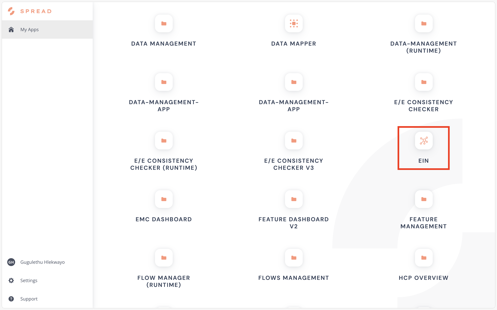
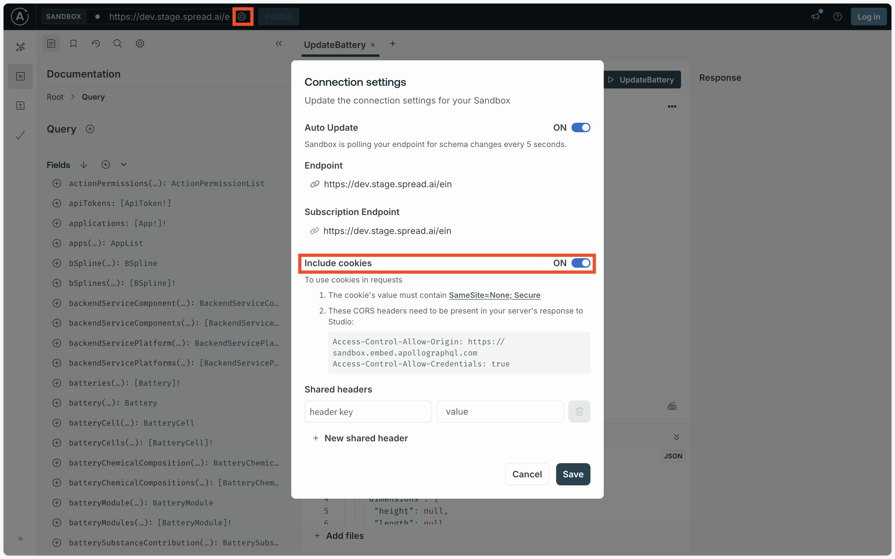
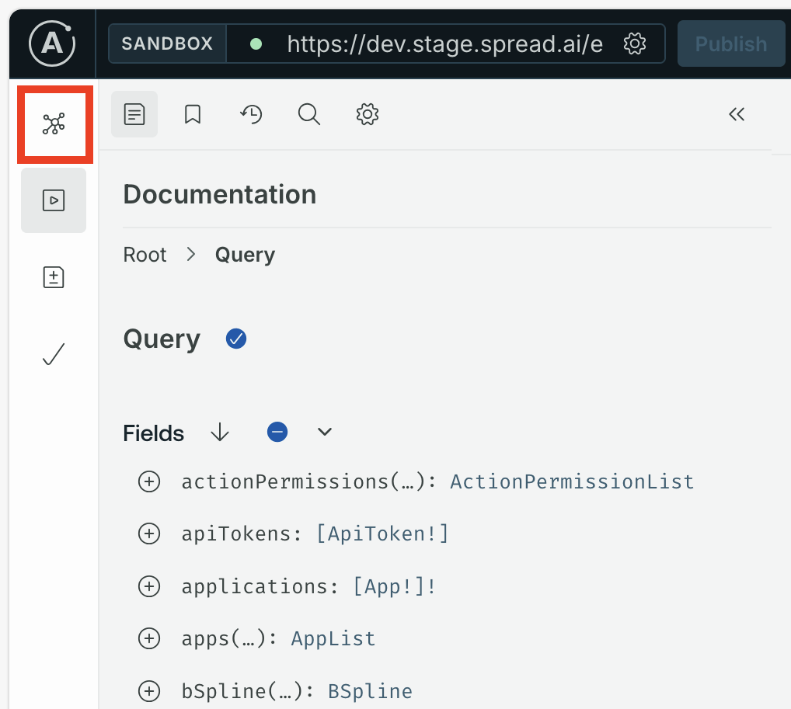
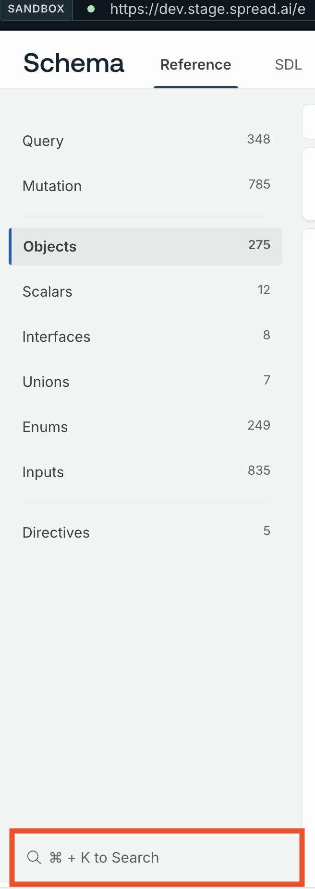
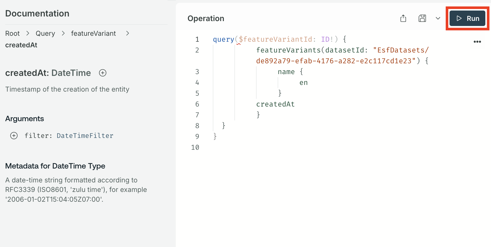

To get data from the Engineering Intelligence Graph (EI Graph) we need to query the GraphQL database. GraphQL is a graph-based database that allows us to fetch only the data we need, unlike with REST APIs. In this lesson we will learn how to make a query from within SPREAD Studio and use the results in a [table](#) widget.

## GraphQL queries

To fetch data from a GraphQL database we use _queries_ in the similar way to a `GET` request in a REST API. The key difference being that the response can be defined, so that we get only the data we need. A REST API request might return a JSON object that needs to be parsed afterwards to get the required data.

{{ snippets.whatIsAFeatureVariant }}

A GraphQL query contains the following:

<div class='grid' markdown>

!!! example "GraphQL query structure"

     This request fetches the names (in English) of the feature variants
     ---

     ```json 
     query {
          featureVariants(datasetId: "EsfDatasets/de892a79-efab-4176-a282-e2c117cd1e23") { // (1)
               name {
                    en
               }
          }
     }
     ```

     1. The `dataSetId` defines the dataset that this data is pulled from.
     
!!! success "GraphQL output"

     The output returned by the GraphQL
     ---

     ```json
     {
          "data": {
               "featureVariants": [
                         {
                              "name": {
                                   "en": "Adaptive Cruise Control"
                              }
                         },
                         {
                              "name": {
                                   "en": "Rear Parking Sensors"
                              }
                         },
                         ...
     }
     ```
</div>

In the query above we include the `datasetId` as an inline variable, but it's also possible to provide variables in a separate object and then call the variable using the `$` symbol.

<div class='grid' markdown>

!!! example "GraphQL query structure"

     This request uses `$variableID` as the `datasetID`
     ---

     ```json hl_lines="2"
     query Query($variableID: ID!) {
          featureVariants(datasetId: $variableID) {
               name {
                    en
               }
          }
     }
     ```
     
!!! example "GraphQL variables"

     This object sets the `variableID` for use in the query
     ---

     ```json
     {"variableID": "EsfDatasets/de892a79-efab-4176-a282-e2c117cd1e23"}
     ```
</div>

!!! abstract "Task 1: Run the example query"

     Run the GraphQL query example above at this [URL]({{ snippets.demoInstanceEinURL }}), using either inline variables or variables defined in an object. The title windows will tell you where to paste each code snippet.

## Finding the query

Knowing how to make query leads on to knowing where to find the query that gives you the information that you want. GraphQL provides a self-documenting function that produces the Schema Definition Language (SDL) reference, which is similar to REST API references. To view the SDL reference select the **EIN** tile from the SPREAD Launcher.

<figure markdown="span">
     
     <figcaption>The EIN tile in the SPREAD Platform launcher</figcaption>
</figure>

{{ snippets.demoInstanceDetails }}

??? failure "Schema introspection failure"

     If you see a "Schema introspection failure" error when opening the EIN tile, go to the **Connection Settings** in the top-left and select **Include cookies** to resolve it.

     

Then select the **Schema** icon on the left-hand side to open the SDL reference.

<figure markdown="span">
     { .img-medium }
     <figcaption>The button to access the SDL reference</figcaption>
</figure>

For example, to search for an endpoint that returns the when feature variants were created and a description, we would first bring up the search interface by pressing the **⌘** (for macOS) or **CTRL** (for Linux and Windows) and **K** keys at the same time or by clicking the button at the bottom of the reference sidebar.

<figure markdown="span">
     { .img-medium }
     <figcaption>The search button in the SDL reference is highlighted in the red box</figcaption>
</figure>

<?quiz?>
question: Which search term will return documentation for a query on featureVariants?
answer-correct: "query.featureVariants"
answer: "featureVariant"
answer: "featureVariants query"
answer: "query.featureVariant"
answer: "find featureVariant"
content:
<p></p>
<?/quiz?>

### Reading the SDL

<figure markdown="span">
     { .img-medium }
     <figcaption>Documentation about the `featureVariants` endpoint</figcaption>
</figure>

The GraphQL syntax - `[featureVariant]!` - tells us that the `featureVariants` object contains an array list of `featureVariant` objects. The `[]` signifies an array list. For more on reading the Schema Definition Language, see [Schema GraphQL basics](https://www.apollographql.com/docs/apollo-server/schema/schema). Furthermore, the `featureVariant` objects has the following description:

> Feature variant describes a specific realization of a feature. It's one of possible many ways of implementing a feature, considering different capabilities of the hardware components, market requirements, etc.

Selecting the `featureVariant` object gives more detail on the fields of the object.

<figure markdown="span">
     { .img-medium }
     <figcaption>Documentation about the `featureVariant` endpoint</figcaption>
</figure>

## Exploring the endpoint field

To further explore the `createdAt` field select the play icon on the right to open the GraphQL Explorer.

<figure markdown="span">
     { .img-medium }
     <figcaption>Explore the `createdAt` field</figcaption>
</figure>

To run a test call select the **▶️ Run** button at the top of the **Operation** window. Remember that we have to provide the `datasetId` to get the data from the right dataset. 

<figure markdown="span">
     { .img-medium }
     <figcaption>Running the API call</figcaption>
</figure>

[Open the demo GraphQL request](https://app.spread.ai/ein?explorerURLState=N4IgJg9gxgrgtgUwHYBcQC4QEcYIE4CeAFACQBmCAhijHggGqV4CWlqAkmOgATsAiAQgCU3YAB0k3KdJkVqtBk1aoAzkTDVKKhCk48xIAKIqyfTdpQqA9GAQAOAJwAmSgHYHAWgRlKAIw8ALACMrgBsHpROdk5eTlBBIVBgQQhOAMwGIuKSMrm5SJSIohJ5paXIJWV5AL6VZVB01AhgAIIodaW1OV1dIAA0IABuSn4ANggqGCDZUgZyNHSMLGy6YAY8SDCjoxLV-SAADhAqKGSjzADmABYoAPIH%2BNTMEEgAyg3MB2iYINVAA){ .md-button .md-button--primary }
<br>
<br>

The API call returns the output as displayed below:

```json
{
  "data": {
    "featureVariants": [
      { // (2)
        "name": {
          "en": "Adaptive Cruise Control" // (3) 
        },
        "createdAt": "2024-12-13T16:06:58.926Z" // (1)
      },
      {
        "name": {
          "en": "Rear Parking Sensors"
        },
        "createdAt": "2024-12-13T16:06:58.926Z"
      },
      {
        "name": {
          "en": "Air Conditioning"
        },
        "createdAt": "2024-12-13T16:06:58.926Z"
      },
      {
        "name": {
          "en": "Airbags"
        },
        "createdAt": "2024-12-13T16:06:58.926Z"
      },
      {
        "name": {
          "en": "Infotainment System"
        },
        "createdAt": "2024-12-13T16:06:58.926Z"
      },
      {
        "name": {
          "en": "Lane Keeping Assistance"
        },
        "createdAt": "2024-12-13T16:06:58.926Z"
      },
      {
        "name": {
          "en": "Electronic Stability Control"
        },
        "createdAt": "2024-12-13T16:06:58.926Z"
      },
      {
        "name": {
          "en": "Automatic Emergency Braking"
        },
        "createdAt": "2024-12-13T16:06:58.926Z"
      },
      {
        "name": {
          "en": "Blind Spot Monitoring"
        },
        "createdAt": "2024-12-13T16:06:58.926Z"
      }
    ]
  }
}
```

1. This tells us that the 'Adaptive Cruise Control' feature variant was created on this date.
2. Each object (inside the curly braces) in this list contains a different feature variant.
3. The feature variant's name in English (`en`).

Running the call should return a successful response and the data we want. Note that the response is defined by what we ask for in the **Operations** window. If we added the `description` field to the query the reponse would have an additional field with that data. The description has an `en` field within it to define the language of the response.

```json title="Adding the description field to the query"
query($featureVariantId: ID!) {
          featureVariants(datasetId: "EsfDatasets/de892a79-efab-4176-a282-e2c117cd1e23") {
               name {
                    en
               }
          createdAt
          description {
               en
          }
     }
  }
}
```

!!! abstract "Task 2: Run the query with the description field"

     Run the GraphQL query example above at this [URL]({{ snippets.demoInstanceEinURL }}), using variables defined in an object. The title windows will tell you where to paste each code snippet.

<blockquote class="next-lesson">In the <a href="creating-a-display-application.html">next lesson</a> we'll be creating a Studio application that fetches data from EI Graph and then displays it inside the application.</blockquote>