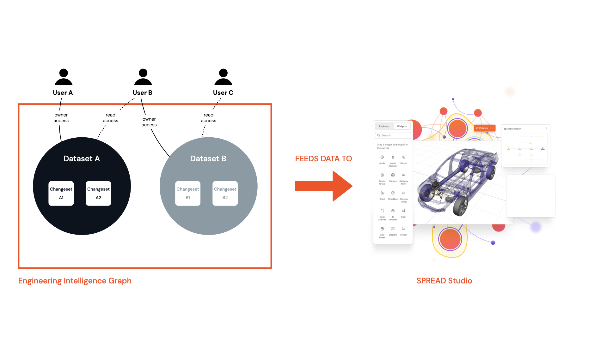

To create applications that display data from the Engineering Intelligence Graph (EI Graph) we need to understand how the components inside it work. These are datasets, changesets, and dataset ownership. Without data we can't create applications that visualize information.

<figure markdown="span">
     
     <figcaption>A diagram showing the relationship of components inside the EI Graph</figcaption>
</figure>

## Understanding datasets and changesets

The EI Graph has a number of domains - such as the Electric, Software, and Function (ESF) domain - which handles data and business logic data related to the electrics and software. Other domains include the CAD domain, which handles data from computer aided diagrams.

Datasets are collections of data that have an ID like this one: `EsfDatasets/b8169x23-7dc2-4319-aa23-473a687d960b`. When querying data you need to specify a dataset to query. In the diagram above there are two datasets: Dataset A and Dataset B.

Changesets are the versions of a dataset. Over time the data contained in a dataset may change and each iteration of the dataset is know as a changeset. In the diagram there are four changesets: Changeset A1 and Changeset A2 for Dataset A, and Changeset B1 and Changeset B2 for Dataset B.

## Dataset permissions

To be able to create applications that use data from a specific dataset you need to either have `Owner` access - which allows you to read, write, and share a dataset - or have `reader` access assigned to you by the owner of the dataset.

For more assigning access rights to datasets, see [Using Data Manager](#).

* :material-list-status:{ .lg .middle } **Quiz**

    ---

