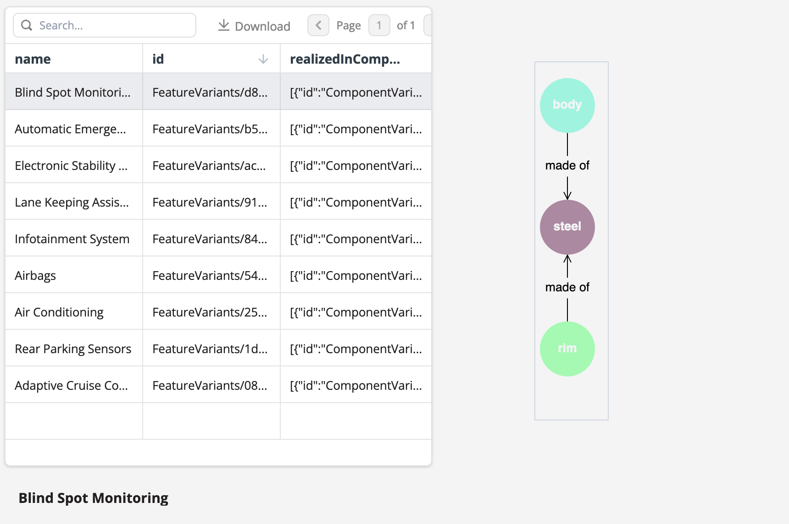
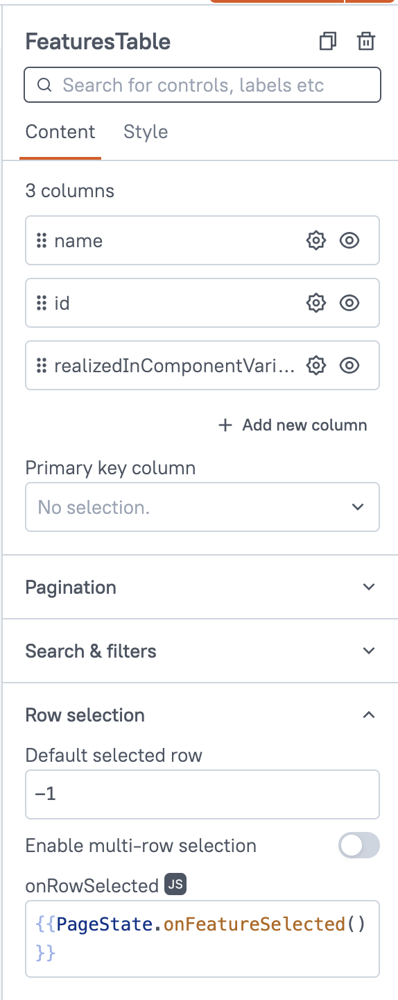
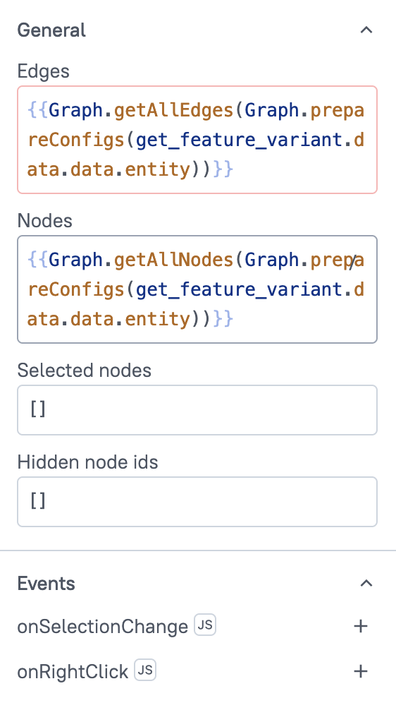

In the [previous module](module-2/creating-a-display-application.html) we created a viewing application to display `featureVariant` data in a table. In this lesson we will create a dashboard that graphically shows the relationship between feature variants, components, and software modules.

{{ snippets.demoInstanceDetails }}

To open Studio, select the **Studio** tile in the SPREAD Platform Launcher and open the application we created in [Module 2](module-2/creating-a-display-application.html). We will build a visualization on top of this application. But first, let's learn some terminology.

The graph widget is a visual element to create node diagrams. Nodes can represent different things, but in our visualization they will represent  variants, components, and software modules. Connections between nodes are called edges and they show the relationship between nodes.

{{ snippets.exampleHeading }}
For example, in this graph the nodes are `body`, `steel`, and `rim` and the edges are the connectors with the labels `made of`.

<figure markdown="span">
	{ .img-medium }
	<figcaption>An example of a graph with nodes and edges</figcaption>
</figure>

To create a visualization of the relationships between feature variants, components, and software we need to parse the data we received from the query into data to create nodes and edges in a graph.

{{ snippets.whatIsAFeatureVariant }}

## Adding to the UI

Drag and drop the [Graph]({{ config.site_url }}platform-tools/using-studio/reference/widgets/tab.html) widget onto the Studio canvas. Remember that widgets can be found in the **UI** tab of the **Editor** view on the left-hand side.

<figure markdown="span">
	{ .img-medium }
	<figcaption>Widgets for the data visualization application</figcaption>
</figure>

## Parse the query output

The response returned by the GraphQL query needs to be parsed before it can be used by the Graph widget. Studio allows us add JavaScript to perform data manipulation of this type to prepare the data for visualization. This JavaScript code parses the data and returns the nodes and edges that the Graph widget uses to visualize the data.

Copy the code below, select the **JS** tab in the **Editor** view and paste it into the window. To learn more about what the code does, select the annotation popups.

```js
export default {
     graph: {},
     onFeatureSelected() { // (1)!
          const nodes = []; // (2)!
          const edges = [];
          nodes.push({ // (3)! 
               id: Table1.selectedRow.id,
               label: Table1.selectedRow.name,
               color: "#ef4444"
          });
          Table1.selectedRow.realizedInComponentVariant.forEach(c => { // (4)! 
               nodes.push({
                    id: c.id,
                    label: c.name.en,
                    color: "#064e3b"
               });
               edges.push({ // (5)! 
                    id: Table1.selectedRow.id + '/' + c.id,
                    from: Table1.selectedRow.id,
                    to: c.id,
                    label: "realized by"
               })
               c.usesSoftwareModules.forEach(m => { // (6)! 
                    if (!nodes.includes(n => n.id == m.id)) {
                         nodes.push({
                              id: m.id,
                              label: m.name.en,
                              color: "#b188a3"
                         })
                    }
                    edges.push({ // (7)!
                         id: c.id + '/' + m.id,
                         from: c.id,
                         to: m.id,
                         label: "has software"
                    })
               })
          })
               
          this.graph = {
               nodes,
               edges
          };
          return this.graph; // (8)! 
     }
}
```

1. Run this code on the selected row of the table.
2. Set empty array variables for nodes and edges.
3. Add the selected feature variant's id and label to the nodes array and assign it the color for feature variant nodes.
4. Add each component for the feature variant to the nodes array and assign the color for component nodes.
5. Add edges for with the label 'realized by' to connect the feature variant to its components.
6. Add each software module for the component to the nodes array and assign the color for software module nodes.
7. Add edges for with the label 'has software' to connect the software modules to their components.
8. Collect all the edges and nodes and return them as an object called `graph`.

!!! abstract "Task 1: Name the JavaScript"

     Name the JavaScript code `PageState`.

### Bind the JS code to the table

In order for the JavaScript code to run when a row in the table is selected we need to bind it to the table. Go to the **UI** tab and select the Table widget. In the properties window on the right-hand side, open the **Row selection** section and set **Default selected row** to `-1` and **onRowSelected** to `{{ "{{ PageState.onFeatureSelected() }}" }}`. This binds the `onFeatureSelected` function to the row that has been selected by the user.

<figure markdown="span">
	{ .img-medium }
	<figcaption>Binding JS code to Table widget</figcaption>
</figure>

### Apply bindings to the Graph widget

The parsed output should then be bound to the Graph widget by using these values in the properties window on the right-hand side:

- **Edges:** `{{ "{{PageState.graph.edges}}" }}`
- **Nodes:** `{{ "{{PageState.graph.nodes}}" }}`

This binds the `edges` output from the JavaScript to the edges value of the Graph widget, and likewise for the `node` output.

<figure markdown="span">
	{ .img-medium }
	<figcaption>Binding nodes and edges in the Graph widget</figcaption>
</figure>

In the style configuration tab, use the following settings to style the widget:

- **Mode:** Layered
- **Direction:** Down

!!! abstract "Task 2: Change the Graph styling"

     Experiment with different values for **Mode** and **Direction** to create a graph that goes from left to right.

## Publish the application

{{ snippets.publishApp }}


<br>
[Download the solution (7kb) :material-download: ](src/module-3.zip){ .md-button .md-button--primary }
<figcaption class='download'>Unzip the file, open the <a href="module-1/creating-a-studio-application.html#organizing-your-workspace">Studio Workspace</a>, select <strong>Create New</strong> > <strong>Import</strong>, and import the unzipped file.</figcaption>
<br>

<blockquote class="next-lesson">In the <a href="/getting-started/module-4/understanding-graphql-mutations.html">next module</a> we'll learn about writing data data to the Engineering Intelligence Graph.</blockquote>
