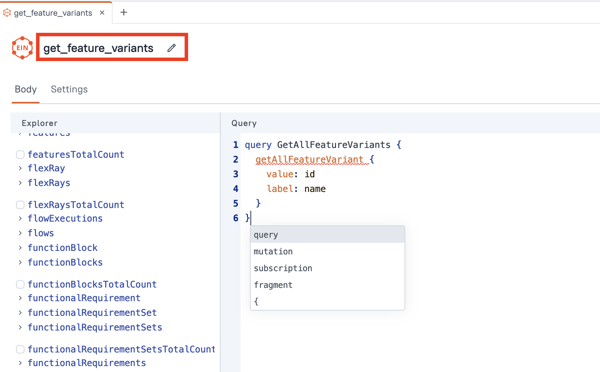
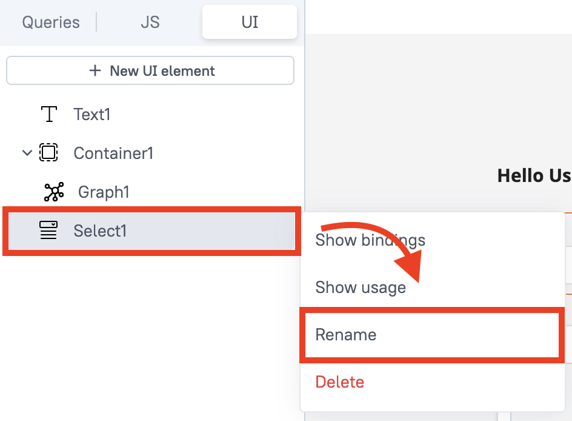

In the previous module we created a viewing application to display `featureVariant` data in a table. In this lesson we will create a dashboard that graphically shows the relationship between feature variants and software modules.

{{ snippets.demoInstanceDetails }}

To open Studio, select the **Studio** tile in the SPREAD Platform Launcher.

## Create the UI

Drag and drop the following widgets onto the Studio canvas:

- A [Text]({{ config.site_url }}platform-tools/using-studio/reference/widgets/text.html) widget for the title of the application.
- A [Select]({{ config.site_url }}platform-tools/using-studio/reference/widgets/select.html) widget to select the feature variant.
- A [Container]({{ config.site_url }}platform-tools/using-studio/reference/widgets/container.html) widget to hold the data visualization widget.
- A [Graph]({{ config.site_url }}platform-tools/using-studio/reference/widgets/tab.html) widget onto the Container widget.

Remember that widgets can be found in the **UI** tab of the **Editor** view on the left-hand side.

<figure markdown="span">
	
	<figcaption>Widgets for the data visualization application</figcaption>
</figure>

Now that we've set the UI foundation we can look at how to get data from the feature variant we select in the UI.

## Create the feature variants filter query

This GraphQL query accepts whatever is inputted into the Select widget as parameters to use to find the right feature variants to display.

Go to the **Queries** tab of the **Editor** view on the left-hand side and select **New query/API**. Under **Quick actions** select **EIN API**. In the middle **Query** window enter this GraphQL query.

```
query GetAllFeatureVariants {
  getAllFeatureVariant {
    value: id // (1)
    label: name // (2)
  }
}
```

1. xxxxx
2. xxxxx

Name the query `get_feature_variants` at the top.

<figure markdown="span">
	
	<figcaption>Creating a query to get feature variants</figcaption>
</figure>

## Edit the Select widget settings

Go back to the Studio canvas by selecting the **UI** tab and select the **Select** widget. To pass data to the query and back we need to bind it to this widget. Rename the widget `FeatureVariantSelect` by double-clicking on it in the **UI** window or by using the three-dot menu.

<figure markdown="span">
	
	<figcaption>Renaming the Select widget</figcaption>
</figure>

Then change the following settings in the properties window on the right-hand side:

- **Source Data:** `{{ "{{get_feature_variants.data.data.getAllFeatureVariant}}" }}`
- **Label key:** `label`
- **Value key:** `value`

You may also change the **Default selected value** and the 

<figure markdown="span">
	
	<figcaption>Renaming the Select widget</figcaption>
</figure>

## Create the feature variant query

One a feature variant has been identified, this query fetches data about it to populate the Graph widget.

Go to the **Queries** tab of the **Editor** view on the left-hand side and select **New query/API**. Under **Quick actions** select **EIN API**. In the middle **Query** window enter this GraphQL query.

```json
query getFeatureVariant($findBy: FetchEntityInput) {
  entity(findBy: $findBy) {
    ... on FeatureVariant {
      id
      name
      description
      realizedIn {
        id
				
        softwareModule {
          id
          name
		  description
        }
        softwareContainer {
          id
          name
		  description
        }
        componentVariant {
          id
          name
        }
      }
      realizedInComponentVariant {
        id
        name
      }
      originalId
			realizes {
        hasResponsible {
          firstName
          lastName
        }
      }
    }
  }
}
```

In the variable window, insert these variables that are provided to the query as parameters:

```json
{
  "findBy": {
    "type": "FeatureVariant",
    "id": {{ "{{FeatureVariantSelect.selectedOptionValue}}" }}
  }
}
```

Name the query `get_feature_variant` at the top.

<figure markdown="span">
	
	<figcaption>Widgets for the data visualization application</figcaption>
</figure>


## Parse the query output


### Edit widget settings and bindings

## Publish the application
