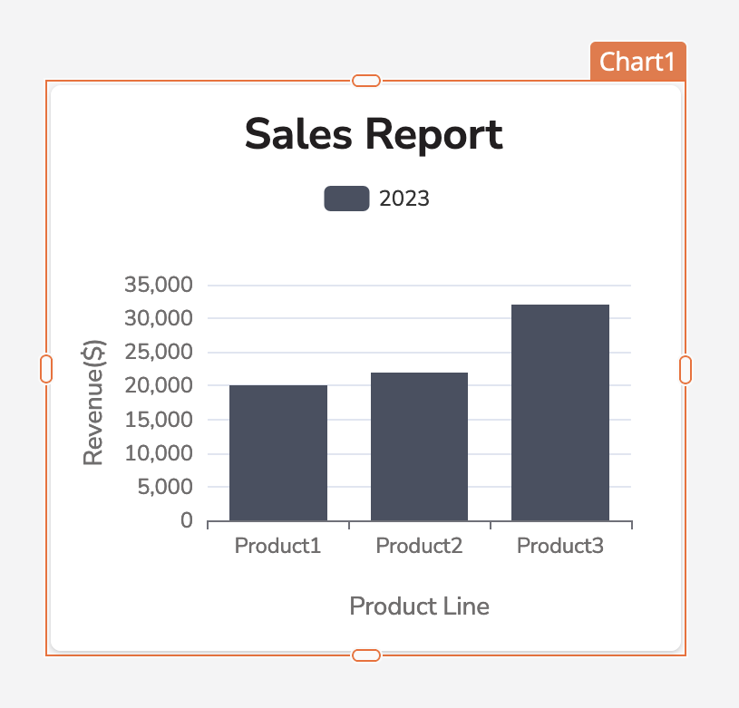

One of the benefits of structured data is that it can be rearranged, changed, and presented in different ways. For many use cases a visual representation of product data can cut down the time it takes to analyze and understand your product. SPREAD Studio offers a number of ways to visualize data in the custom applications that you can create. The more popular visualizations widgets (and their accessories) are introduced below.

- __Wiring Harness widget__

     ---

     The Wiring Harness widget displays a 2D view of the wiring harness.

     

     [:octicons-arrow-right-24: More info](/platform-tools/using-studio/reference/widgets/spread-widgets.md#wiring-harness)

- __Renderer widget__

     ---

     The Renderer widget is a visual element that renders 3D objects.

     

     [:octicons-arrow-right-24: More info](/platform-tools/using-studio/reference/widgets/spread-widgets.md#renderer)

- __Chart widget__

     ---

     The Chart widget is used to visualize and represent data on admin panels, dashboards, and other data-driven applications.

     

     [:octicons-arrow-right-24: More info](/platform-tools/using-studio/reference/widgets/chart)

- __Guided Event Chain widget__

     ---

     The Guided Event Chain widget displays the flow of guided events.

     

     [:octicons-arrow-right-24: More info]({{ config.siteURL }}/platform-tools/using-studio/reference/widgets/spread-widgets.md#guided-event-chain)

- __Precedence Graph widget__

     ---

     The Precedence Graph widget represents the precedence of items in a concurrent system.

     

     [:octicons-arrow-right-24: More info](/platform-tools/using-studio/reference/widgets/spread-widgets.md#precedence-graph)

- __Topology viewer widget__

     ---

     The Topology Viewer widget displays the graph with nodes and edges oriented as a tree. 

     

     [:octicons-arrow-right-24: More info](/platform-tools/using-studio/reference/widgets/spread-widgets.md#topology-viewer)

