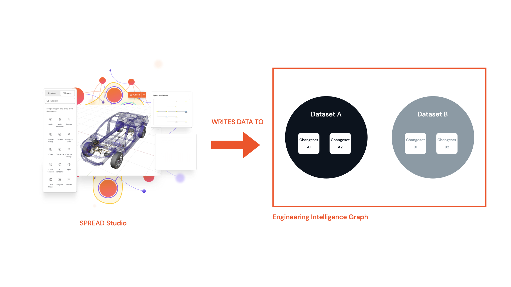
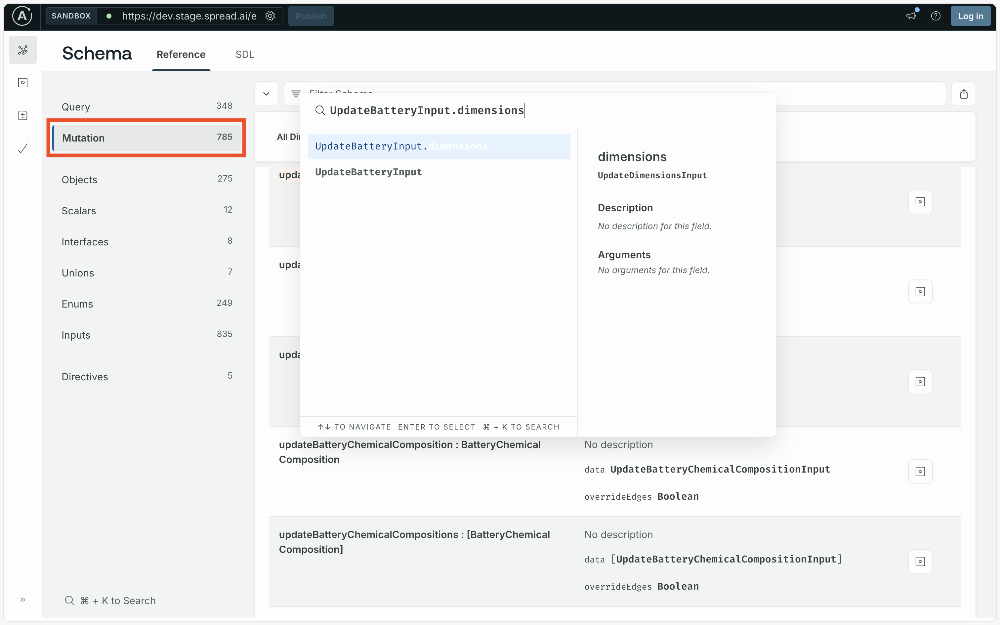
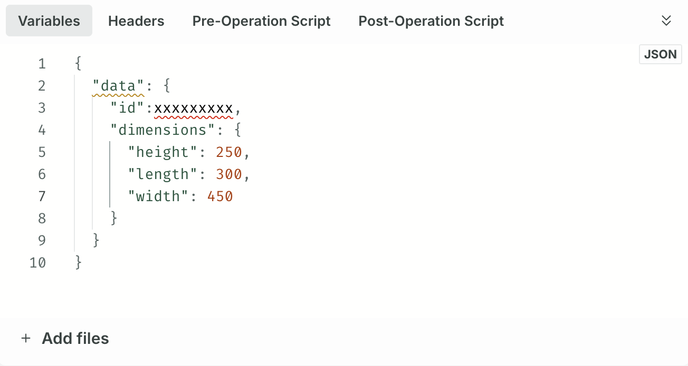

In [Module 2](../module-2/querying-spread.md#finding-the-query) we covered finding data, but the reverse is also possible: we can write data to the Engineering Intelligence Graph (EI Graph). To write data to a GraphQL database we use _mutations_ in the similar way to a `PUT`, `DELETE`, or `PATCH` request in a REST API.

<figure markdown="span">
     
     <figcaption>Mutations write to the EI Graph</figcaption>
</figure>

For example, a GraphQL mutation for creating a battery looks like the following:

```json title="GraphQL mutation structure"
mutation CreateBattery($datasetId: ID!) {
  createBattery(datasetId: $datasetId) {
    variants {
      
    }
    id
    externalIds {
      
    }
    weight
    supplier {
      
    }
    model {
      
    }
    modules {
      
    }
    ratedCapacity
    createdAt
    updatedAt
    dimensions {
      
    }
    revision
    previous {
      
    }
    next {
      
    }
    latest {
      
    }
    draft {
      
    }
    history {
      
    }
    esfChangeset {
      
    }
  }
}
```

The values for each of the fields is provided via the **Variables** window in EIN Explorer.

## Finding the mutation

Like with [queries](../module-2/querying-spread.md) you can use the Schema Definition Language (SDL) reference to find the right mutation for your needs. For more on using the reference, see [Finding the query](../module-2/querying-spread.md#finding-the-query). To view the SDL reference select the **EIN** tile from the SPREAD Launcher.

---

{{ snippets.demoInstanceDetails }}

---

??? failure "Schema introspection failure"

     If you see a "Schema introspection failure" error when opening the EIN tile, go to the **Connection Settings** in the top-left and select **Include cookies** to resolve it.

     

If you wanted to change the dimensions of a battery you may search the reference for something like `updateBattery.dimensions` and see what the search returns. Using search terms that describe the action (`update`, `delete`, or `create`), the object that that action is applied to (`battery`), and the field that you want to change (`dimensions`) helps to narrow down the list of possible mutations. Remember to select the **Mutations** tabs (as highlighted in the red box) to get results for mutations.

<figure markdown="span">
     
     <figcaption>Searching for mutation to update the dimensions of a battery</figcaption>
</figure>

## Exploring the mutation

Like with queries, you can click through to the GraphQL Explorer to test the endpoint. Unlike queries, you need to add the new field values that you would like to update or create in the **Variables** window.

<figure markdown="span">
     
     <figcaption>Mutation values in the Variables window</figcaption>
</figure>

Remember that any fields that have an exclamation point in the SDL reference are required fields, so you need to supply a value for them when performing a mutation.
