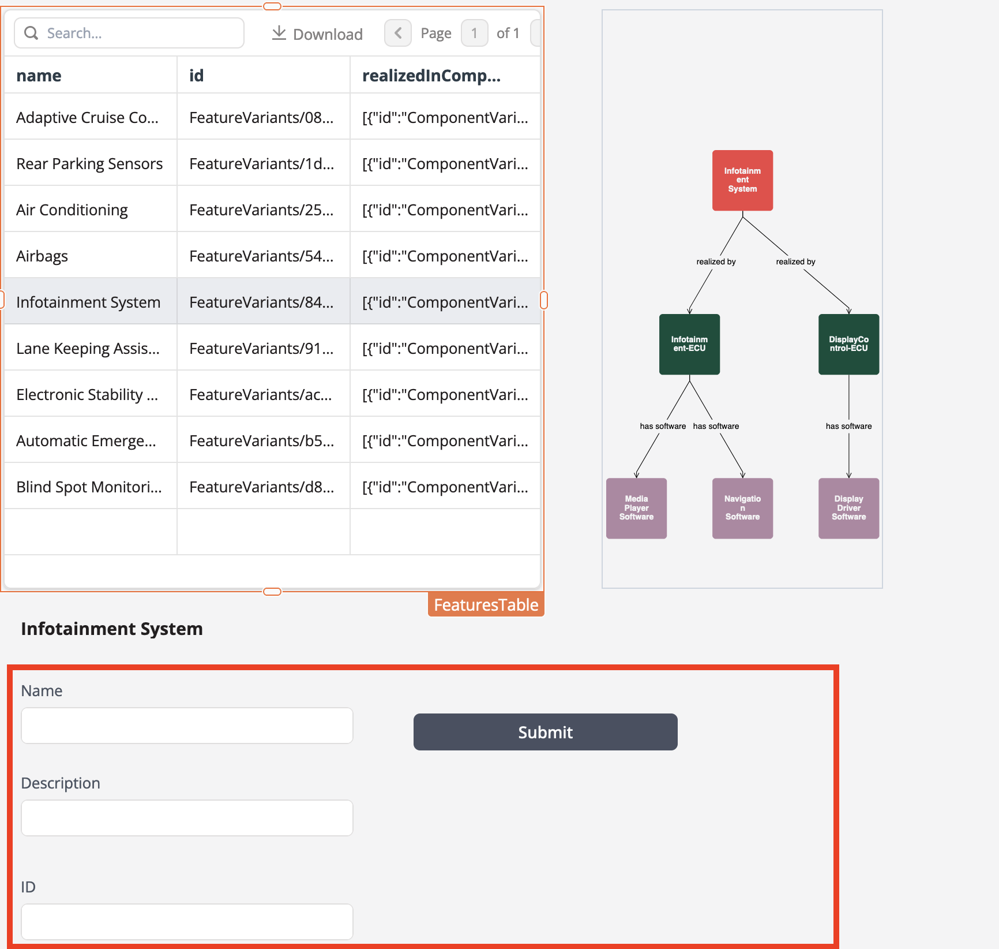
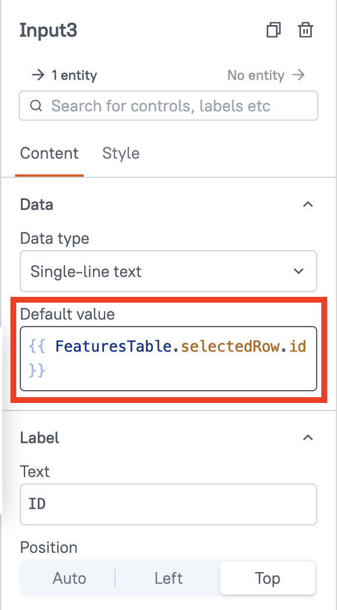
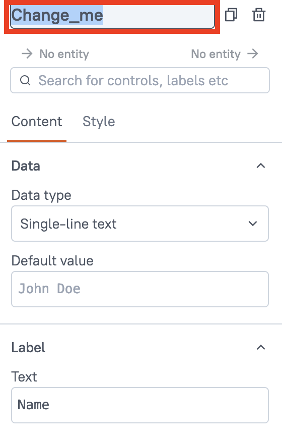
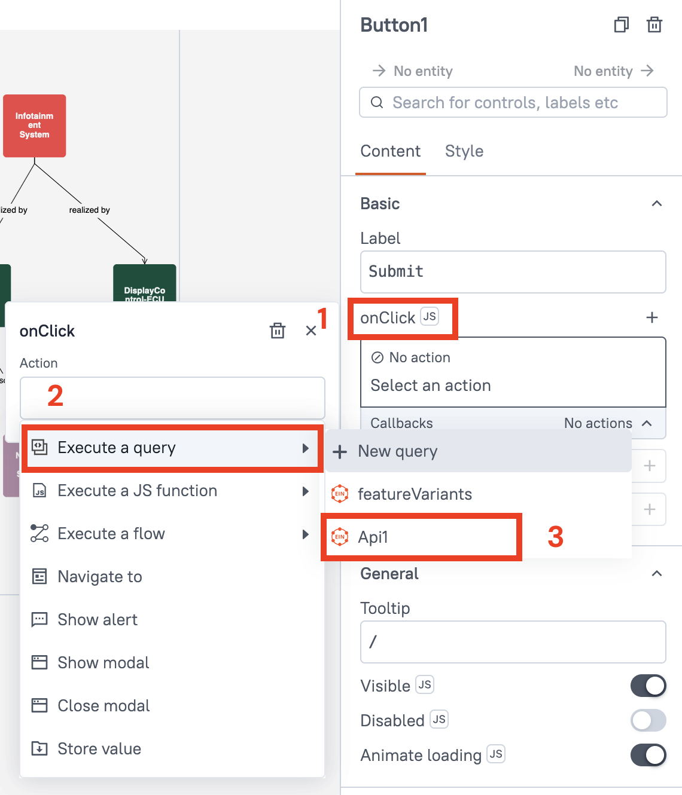

To write data to the Engineering Intelligence Graph (EI Graph) we need a user interface that accepts input from the user before writing it to the database. As we learned in the [previous lesson](understanding-graphql-mutations.md), _mutations_ allow us to edit, update, and create data in the Engineering Intelligence Graph (EI Graph).In this lesson we will use the example mutation from the last lesson to create a new software module. To create a new software module we need:

* An input accepting the new software module's `name`
* An input accepting a `description` of the new software module
* The `id` if the feature variant that the software module is attached to

{{ snippets.demoInstanceDetails }}

## Creating the UI

Drag and drop three text input widgets and a submit button onto the Studio canvas of the applications we created in the last module. Reminder: you can find widgets in the **UI** tab on the left-hand side.

<figure markdown="span">
     { .img-medium }
     <figcaption>Input widgets and submit button</figcaption>
</figure>

!!! abstract "Task 1: Add labels for each text input"

     Add labels for each text input widget. Hint: the options for each widget show up on the right-hand side when you select the widget.

### Autopopulate the ID field

Next, we will autopopulate the ID field with the ID value of the slected row in the table. This avoids us having to copy the ID from the able. Select the text input widget for ID and enter: `{{ "{{ FeaturesTable.selectedRow.id }}" }}` in the **Default value** field.

<figure markdown="span">
     { .img-medium }
     <figcaption>Sync the input field with the table row</figcaption>
</figure>

## Creating the mutation

To create the mutation go to the **Queries** tab and select **New Query/API**. Select **EIN API** in the **Quick actions** section. Use the mutation we created in the last lesson:

<div class='grid' markdown>

!!! example "Query"

     ```json
     mutation CreateSoftwareModule($name: String, $desc: String) {
          createSoftwareModule(datasetId: "EsfDatasets/de892a79-efab-4176-a282-e2c117cd1e23", data: {
               name: {
                    en: $name
               }
               description: {
                    en: $desc
               }
          }) {
               id
          }
     }
     ```
     
!!! example "Query variables"

     ```json
     {
          "data": [
               {
                    "name": {
                         "en": "LIDAR"
                    }
               },
               {
                    "desc": "Sed ut perspiciatis unde omnis iste natus error sit voluptatem accusantium doloremque laudantium, totam rem aperiam, eaque ipsa quae ab illo inventore veritatis et quasi architecto beatae vitae dicta sunt explicabo. Nemo enim ipsam voluptatem quia voluptas sit aspernatur aut odit aut fugit, sed quia consequuntur magni dolores eos qui ratione voluptatem sequi nesciunt. "
               }, 
               {
                    "id": "FeatureVariants/08992c5e-522c-44a0-965f-72f83622c496"
               }
          ]
     }
     ```
</div>

To get the values from the text input boxes we need to bind the output of the widgets to the Query variables.

## Binding the mutation

Switch back to the **UI** tab on the top-left and get the names of each of the text input widgets. The name of the widgets will appear when you hover over them.

<figure markdown="span">
     { .img-medium }
     <figcaption>Sync the input field with the table row</figcaption>
</figure>

You can also change the name of the widget by selecting it and editing the name in the field at the top of the widget properties tab.

<figure markdown="span">
     { .img-medium }
     <figcaption>Change the name of teh widget</figcaption>
</figure>

If you have not changed the names, they should be `Input1`, `Input2`, and `Input3`. Go back to the **Queries** tab and edit the **Queries variables** to get the text from the input fields:

```json title="Query variables" hl_lines="5 9 12"
{
     "data": [
          {
               "name": {
                    "en": {{ "{{ Input1.text }}" }}
               }
          },
          {
               "desc": {{ "{{ Input2.text }}" }}
          }, 
          {
               "id": {{ "{{ Input3.text }}" }}
          }
     ]
}
```

## Set the submit button

Now we need to set the **Submit** button to start the query when it is clicked. Go to the **Submit** widget and select **onClick (JS)** > **Execute a query** and then select the query we created earlier (if you haven't renamed it, it will be `Api1`).

<figure markdown="span">
     { .img-medium }
     <figcaption>Set the submit button to start the query</figcaption>
</figure>

## Publishing and sharing the application

When the application is complete, select the **Publish** button in the top-right corner to make it available from the SPREAD Platform launcher page. To share the application with other users select the **Share** button (next to the **Publish** button) and add users who can either have **Developer** rights to edit the application or **Viewer** rights to just view it.

<figure markdown="span">
     { .img-medium }
     <figcaption>Sharing your application</figcaption>
</figure>

[Open the completed application](https://studio.app.spread.ai/app/example-app/page1-677fc78197809505bda97461){ .md-button .md-button--primary }
<br>
<br>

<blockquote class="next-lesson">Congratulations, you have completed the Introduction to SPREAD Platform course. Fore more, see <a href="/platform-tools/using-studio/creating-studio-applications.html">Creating Studio applications</a>.</blockquote>
