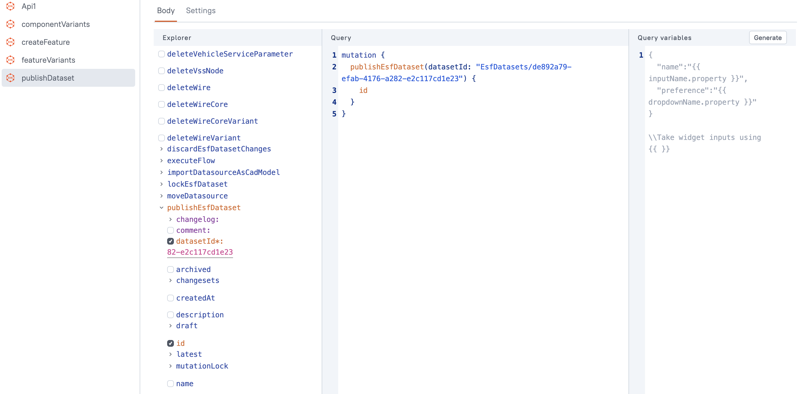

To write data to the Engineering Intelligence Graph (EI Graph) we need a user interface that accepts input from the user before writing it to the database. As we learned in the [previous lesson](understanding-graphql-mutations.md), _mutations_ allow us to edit, update, and create data in the Engineering Intelligence Graph (EI Graph).In this lesson we will use the example mutation from the last lesson to create a new feature variant. To create a new feature variant we need:

* An input accepting the new feature variant's `name`.
* An input accepting a `description` of the new feature variant.
* The `componentId` of the components where the feature variant is realised.

{{ snippets.demoInstanceDetails }}

## 1. Import the template application

To expedite the process we have created a template application for us to complete by adding the correct mutation. Download the application below and [import it in Studio]({{ config.site_url }}getting-started/module-1/creating-a-studio-application.html#1-organizing-your-workspace).

<br>
[Download the solution (7kb) :material-download: ](src/module-4-template.zip){ .md-button .md-button--primary }
<figcaption class='download'>Unzip the file, open the <a href="{{ config.site_url }}getting-started/module-1/creating-a-studio-application.html#1-organizing-your-workspace">Studio Workspace</a>, select <strong>Create New</strong> > <strong>Import</strong>, and import the unzipped file.</figcaption>
<br>

!!! abstract "Task 1: Import the application in Studio"

     Import the downloaded JSON file above into Studio. Hint: Start by selecting the **Studio** tile in the SPREAD launcher and then...
     

The application includes a query to list component options and a modal to receive data from the user. Remember that a feature variant is made of components. For example, airbags might consist of a component that senses when a crash has happened and a component that deploys the airbag. When we create a feature variant we will also select components to include within it. For more, see [Creating a display application]({{ config.site_url }}getting-started/module-2/creating-a-display-application.html).

## 2. Creating the mutation

To create the mutation go to the **Queries** tab and select **New Query/API**. Select **EIN API** in the **Quick actions** section. Use the mutation we created in the [last lesson](understanding-graphql-mutations.md):

<div class='grid' markdown>

!!! example "Query"

     ```json
     mutation CreateFeature($name: String!, $desc: String!, $componentIds: [ID]) {
          createFeatureVariant(datasetId: "EsfDatasets/de892a79-efab-4176-a282-e2c117cd1e23", data: {
               name: {
                    en: $name
               }
               description: {
                    en: $desc
               }
               realizedInComponentVariantIds: $componentIds
          }) {
               id
          }
     }
     ```
     
!!! example "Query variables"

     ```json
     {
	     "name": "Test Variant",
	     "desc": "A description here.",
	     "componentIds": ["ComponentVariants/afc516af-Oc7a-4768-a972-8ff52f289c84"]
     }
     ```
</div>

Name the query `createFeature`. To get the values from the text input boxes we will need to bind the output of the widgets to the Query variables.

## 3. Get the output from the text widgets

Switch back to the **UI** tab on the top-left and get the names of each of the text input widgets in the modal. Select the **Create** button and take note of the names of the widgets. The name of the widgets will appear when you hover over them.

<figure markdown="span">
     { .img-medium }
     <figcaption>Hover over the widgets</figcaption>
</figure>

You can also change the name of the widget by selecting it and editing the name in the field at the top of the widget properties tab.

<figure markdown="span">
     { .img-medium }
     <figcaption>Change the name of the widget</figcaption>
</figure>

If you have not changed the names, they should be `NameInput`, `DescInput`, and `ComponentSelect`. Go back to the **Queries** tab and edit the **Queries variables** to get the text from the input fields:

!!! example "Query variables"

     ```json hl_lines="2 3 4"
     {
	     name: {{ "{{ NameInput.text }}" }},
	     desc: {{ "{{ DescInput.text }}" }},
	     componentIds: {{ "{{ ComponentSelect.selectedOptionValues }}" }}
     }
     ```

## 4. Publish the dataset

For the newly created feature variant to show up in the table, we need to publish the dataset. To publish the dataset we need to use another mutation called `publishEsfDataset`. The Electric, Software, and Function (ESF) domain refers to the SPREAD back-end service that handles business logic in electrics, software, or functions in a product - such as an automobile. ESF is one of the core domains in the EI Graph.

!!! abstract "Task 2: Create the mutation to publish the dataset"

     Go to [Apollo Explorer]({{ config.site_url }}ein) and find the mutation that will publish a dataset. For more on finding queries and mutations, see [Finding the query]({{ config.site_url }}/getting-started/module-2/querying-spread.html#finding-the-query).

      <br>
     [See the solution](https://app.spread.ai/ein?explorerURLState=N4IgJg9gxgrgtgUwHYBcQC4RxighigSwiQAIAFGAIwBsCBnACwFE6AzAEX1zoRQAoAJGC48UASTDoSY9gEIAlCWAAdUiQAOVWoxYcRvPsLyiJUofvFhFKtSRIEwquwF9VzkABoQAN1wAnAlwaBDoMEBtlFGVwCwloqWjdTmNeOgB6MAQADgBOACZcAHYcgFoEViCSgBYARkKANhLcPKy8sryoGrqoMBqEPIBmaLcQZyA){ .md-button .md-button--primary }
     
Once you have found the correct mutation, add it in Studio: go to the **Queries** tab and select **New Query/API**, select **EIN API** in the **Quick actions** section and add the mutation.

```json
mutation {
	publishEsfDataset(datasetId: "EsfDatasets/de892a79-efab-4176-a282-e2c117cd1e23") {
	  id
	}
}
```

Name the query `publishDataset`.

<figure markdown="span">
     
     <figcaption>Mutation to publish the dataset</figcaption>
</figure>

Normally, the next step would involve binding this mutation to a widget to automatically run it when the **Create** button in the UI is pressed by the user. In our case this logic has already been done as this is an introductory course.

## 5. Publishing the application

When the application is complete, select the **Publish** button in the top-right corner to make it available from the SPREAD Platform launcher page. Run the application from the Launcher and test that the newly added feature variant appears in the table once you have created it.

<br>
[Download the solution (7kb) :material-download: ](src/module-4.zip){ .md-button .md-button--primary }
<figcaption class='download'>Unzip the file, open the <a href="{{ config.site_url }}getting-started/module-1/creating-a-studio-application.html#1-organizing-your-workspace">Studio Workspace</a>, select <strong>Create New</strong> > <strong>Import</strong>, and import the unzipped file.</figcaption>
<br>

<blockquote class="next-lesson">Congratulations, you have completed the Introduction to SPREAD Platform course. For more, see <a href="/platform-tools/using-studio/creating-studio-applications.html">Creating Studio applications</a>.</blockquote>
