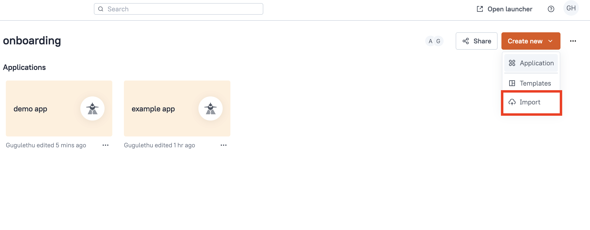
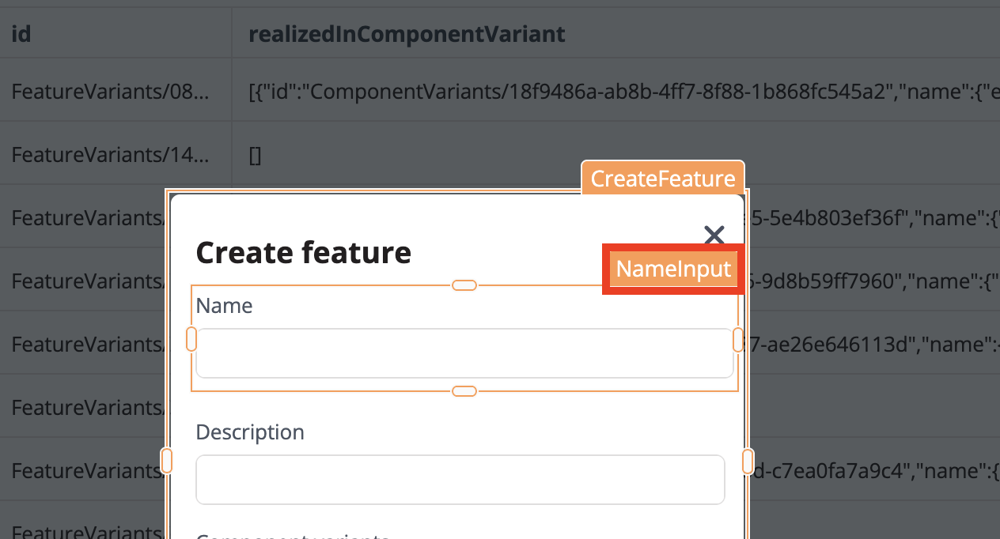

To write data to the Engineering Intelligence Graph (EI Graph) we need a user interface that accepts input from the user before writing it to the database. As we learned in the [previous lesson](understanding-graphql-mutations.md), _mutations_ allow us to edit, update, and create data in the Engineering Intelligence Graph (EI Graph).In this lesson we will use the example mutation from the last lesson to create a new feature variant. To create a new feature variant we need:

* An input accepting the new feature variant's `name`
* An input accepting a `description` of the new feature variant
* The `componentId` of the components where the feature variant is realised

{{ snippets.demoInstanceDetails }}

## Creating the UI

To expedite the process we have created a template application for us to complete by adding the correct mutation. Download the application below and import it in Studio.

[Download demo application](src/demo-app.json){ .md-button .md-button--primary }
<br>
<br>

!!! abstract "Task 1: Import the application in Studio"

     Import the downloaded JSOn file above into Studio. Hint: Start by selecting the **Studio** tile in the SPREAD launcher and then...
     

The application includes a query to automatically publish the dataset after we have added a new feature variant and a query to list optiosn in the modal. For more on Data Manager and working with dataset, see the course on  [Data Management in Studio]().

## Creating the mutation

To create the mutation go to the **Queries** tab and select **New Query/API**. Select **EIN API** in the **Quick actions** section. Use the mutation we created in the last lesson:

<div class='grid' markdown>

!!! example "Query"

     ```json
     mutation CreateFeature($name: String!, $desc: String!, $componentIds: [ID]) {
          createFeatureVariant(datasetId: "EsfDatasets/de892a79-efab-4176-a282-e2c117cd1e23", data: {
               name: {
                    en: $name
               }
               description: {
                    en: $desc
               }
               realizedInComponentVariantIds: $componentIds
          }) {
               id
          }
     }
     ```
     
!!! example "Query variables"

     ```json
     {
	     "name": "Test Variant",
	     "desc": "A description here.",
	     "componentIds": ["ComponentVariants/afc516af-Oc7a-4768-a972-8ff52f289c84"]
     }
     ```
</div>

Name the query `createFeature`. To get the values from the text input boxes we need to bind the output of the widgets to the Query variables.

## Binding the mutation

Switch back to the **UI** tab on the top-left and get the names of each of the text input widgets in the modal. Select the **Create** button and take note of the names of the widgets. The name of the widgets will appear when you hover over them.

<figure markdown="span">
     { .img-medium }
     <figcaption>Hover over the widgets</figcaption>
</figure>

You can also change the name of the widget by selecting it and editing the name in the field at the top of the widget properties tab.

<figure markdown="span">
     { .img-medium }
     <figcaption>Change the name of teh widget</figcaption>
</figure>

If you have not changed the names, they should be `NameInput`, `DescInput`, and `ComponentSelect`. Go back to the **Queries** tab and edit the **Queries variables** to get the text from the input fields:

!!! example "Query variables"

     ```json hl_lines="2 3 4"
     {
	     name: {{ "{{ NameInput.text }}" }},
	     desc: {{ "{{ DescInput.text }}" }},
	     componentIds: {{ "{{ ComponentSelect.selectedOptionValues }}" }}
     }
     ```

## Publishing the application

When the application is complete, select the **Publish** button in the top-right corner to make it available from the SPREAD Platform launcher page. Run the application from the Launcher and test that the newly added feature variant appears in the table once you have created it. 

[Open the completed application](https://studio.app.spread.ai/app/example-app/page1-677fc78197809505bda97461){ .md-button .md-button--primary }
<br>
<br>

<blockquote class="next-lesson">Congratulations, you have completed the Introduction to SPREAD Platform course. Fore more, see <a href="/platform-tools/using-studio/creating-studio-applications.html">Creating Studio applications</a>.</blockquote>
