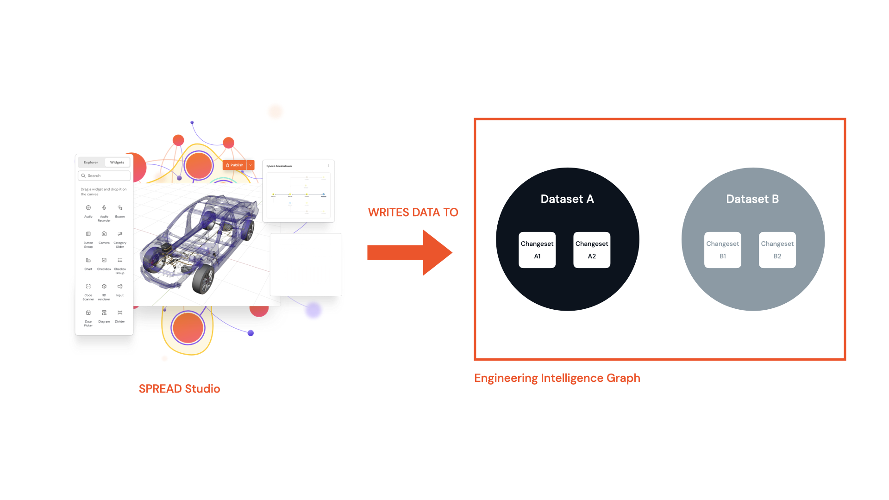
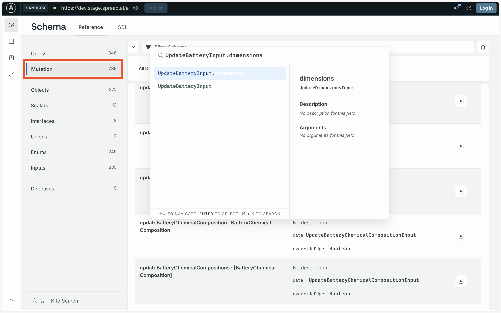
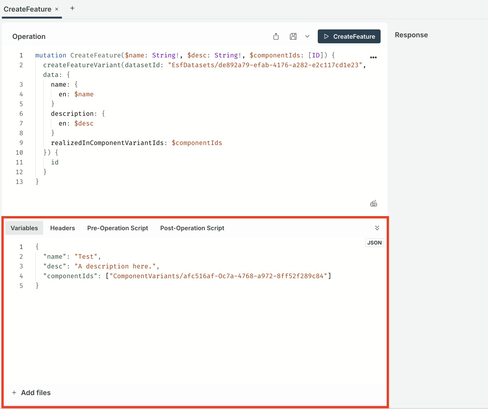

In [Module 2](../module-2/querying-spread.md#finding-the-query) we covered finding data, but the reverse is also possible: we can write data to the Engineering Intelligence Graph (EI Graph). To write data to a GraphQL database we use _mutations_ in the similar way to a `PUT`, `DELETE`, or `PATCH` request in a REST API.

<figure markdown="span">
     
     <figcaption>Mutations write to the EI Graph</figcaption>
</figure>

As a reminder: Changesets are the versions of a dataset. Over time the data contained in a dataset may change and each iteration of the dataset is know as a changeset. In the diagram there are four changesets: Changeset A1 and Changeset A2 for Dataset A, and Changeset B1 and Changeset B2 for Dataset B.


!!! info "Publishing changes"

     With mutations changes that aren't published only apply to changesets, changes that are published apply to datasets as a whole.

Published changes can be fetched with queries to the dataset, but unpublished changes need a query that reads changesets to fetch. In a more advanced course, we will cover the difference - but in this course we will only apply changes to changesets.

For example, a GraphQL mutation for updating a feature variant looks like the following:

```json title="GraphQL mutation structure"
mutation UpdateFeatureVariant($datasetId: ID!) {
     updateFeatureVariant {
          description {
               en
          }
     }
}
```

!!! info "What is a Feature Variant?"

     Feature variant describes a specific realization of a feature. It's one of possible many ways of implementing a feature - for example, a feature with different capabilities of or a feature for different market requirements. A more concrete example for a feature variant could be "SoftwareUpdate via USB" versus "SoftwareUpdate via OverTheAir". It describes the realization of a feature in a specific context.

The values for each of the fields is provided via the **Variables** window in EIN Explorer.

## Finding the mutation

Like with [queries](../module-2/querying-spread.md) you can use the Schema Definition Language (SDL) reference to find the right mutation for your needs. For more on using the reference, see [Finding the query](../module-2/querying-spread.md#finding-the-query). To view the SDL reference select the **EIN** tile from the SPREAD Launcher.

---

{{ snippets.demoInstanceDetails }}

---

??? failure "Schema introspection failure"

     If you see a "Schema introspection failure" error when opening the EIN tile, go to the **Connection Settings** in the top-left and select **Include cookies** to resolve it.

     

If you wanted to change the dimensions of a battery you may search the reference for something like `updateBattery.dimensions` and see what the search returns. Using search terms that describe the action (`update`, `delete`, or `create`), the object that that action is applied to (`battery`), and the field that you want to change (`dimensions`) helps to narrow down the list of possible mutations. Remember to select the **Mutations** tabs (as highlighted in the red box) to get results for mutations.

<figure markdown="span">
     
     <figcaption>Searching for mutation to update the dimensions of a battery</figcaption>
</figure>

## Exploring the mutation

Like with queries, you can click through to the GraphQL Explorer to test the endpoint. Unlike queries, you need to add the new field values that you would like to update or create in the **Variables** window.

<figure markdown="span">
     
     <figcaption>Mutation values in the Variables window</figcaption>
</figure>

Remember that any fields that have an exclamation point in the SDL reference are required fields, so you need to supply a value for them when performing a mutation.

For more on using the EIN Explorer, see [](../module-2/querying-spread.md#exploring-the-endpoint-field).

## Dataset permissions

To be able to create applications that use data from a specific dataset you need to either have `Owner` access - which allows you to read, write, and share a dataset - or have `reader` access assigned to you by the owner of the dataset.

For more assigning access rights to datasets, see [Using Data Manager]().

<?quiz?>
question: What is the command to make changes to a GraphQL database?
answer: put
answer: patch
answer-correct: mutation
answer: edit
answer: change
content:
<p></p>
<?/quiz?>
